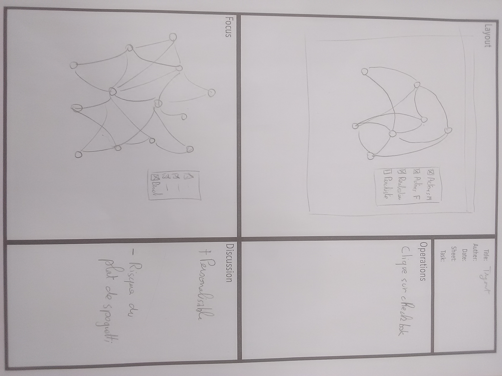
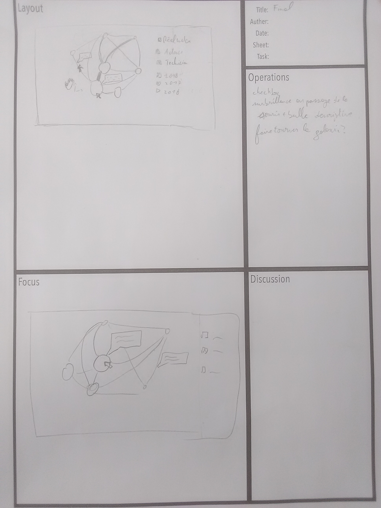

# Proposal

## Brainstorming

In the first steps of our project, we had these ideas to represent links bitween the nominee of the Oscare 2018 :
- to represent it as a network, like a spidrweb : nodes will stand for someone and links will stand for a collaboration
- to make links bigger following the number of collaborations between nodes, and nodes bigger following his total receipts
- to add checkbox in order to select only some people or to choose the year whom collaborations are represented
- to use the picture of people as nodes
- to display tooltips by clicking on nodes or links, to display some informations about people or their collaborations
- to use people's pictures as nodes

<table border="0">
  <tr>
    <td>
      
    </td>
  </tr>
  <tr>
    <td align="center">
      Suggested ideas during the brainstorming.
    </td>
  </tr>
</table>

Finally, after filtering these ideas, we decided not to use people's picures, and to use the checkbox to select only some professions.

## Propositions

We roughly had the same ideas when proposing some designs.

<table border="0">
  <tr>
    <td>
      
    </td>
  </tr>
  <tr>
    <td align="center">
      First proposal
    </td>
  </tr>
</table>
<table border="0">
  <tr>
    <td>
      
    </td>
  </tr>
  <tr>
    <td align="center">
      Second proposal
    </td>
  </tr>
</table>

When thinking about those designs, we all realized these main concerns :
- informations should be more customizable
- there may be too many informations.
