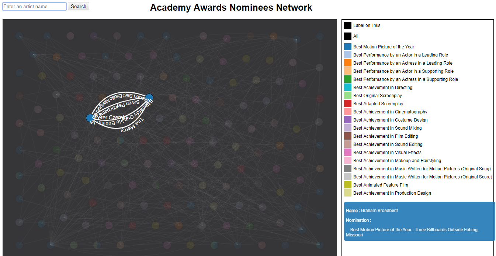

# CineNet Project

The purpose of this project is to show the relations between the nominees of the Oscare 2018. Using a network graph, we want to highlight the interaction between them :

## General presentation

For this visualisation, we chose to represent the nominees with a nide and each collaboration between since 2015 with a link. Each node's color represents the Oscare the person is nominated for.

<table border="0">
  <tr>
    <td>
      
    </td>
  </tr>
  <tr>
    <td align="center">
      General visualization.
    </td>
  </tr>
</table>

The data was taken from [api.themoviedb.org](https://www.themoviedb.org/).

## Functionalities

### Placement

As many nodes are displayed and linked, we introduced three kind of forces to place the nodes :
<ul>
    <li>A radial one to scatter the nodes</li>
    <li>A repulsive one to prevent them from being to close to each other</li>
    <li>A centering one for them to stay around the center of the screen</li>
    <li>An attractive one between the linked nodes</li>
</ul>

We also made the nodes staying in a framework for them not to go out of the screen.

As you can see, the number of nodes and links are making the visualization difficult to understand. That's the reason why we tried to mainly work on the interaction between the user andthe visualization.

### Nodes functionalities

If the user is interested in a particular node, he can just move its mouse over it. Then :
<ul>
    <li>appears a tooltip in the bottom right of the screen, displaying the name of the corresponding person and his nominations</li>
    <li>this person's network is highlighted while the other links and nodes get clear: the names of his collaborators next to the corresponding nodes, the links between them and the name of the movies they worked on together are displayed</li>
</ul> 

By clicking on the node, the network is selected until he clicks on this node again : his network is the only one appearing. The user can then move his mouse over the other nodes connected to learn more about them.

<table border="0">
  <tr>
    <td>
      
    </td>
<td>
      
    </td>
  </tr>
  <tr>
    <td align="center">
      Mouse over a node
    </td>
<td align="center">
      After clicking on a node
    </td>
  </tr>
</table>

The user can also drag the nodes to rearrange the network.

### Checkbox

We also added a checkbox allowing the user to select the information displayed.

First, he can choose to suppress the labels on the links when moving the mouse on a node. Indeed, when the linked nodes are too close, it can be hard to distinguish the labels and the visualization becomes foggy.

<table border="0">
  <tr>
    <td>
      
    </td>
<td>
      
    </td>
  </tr>
  <tr>
    <td align="center">
      With the labels
    </td>
<td align="center">
      Without the labels
    </td>
  </tr>
</table>

He can also choose to display only some kinds of nominees. Indeed he can just move his mouse over the corresponding checkbox category to highlight people from this category's network. He can click on it to display only people from this category (not their network).
He is also able to select or deselect all of them with the "All" checkbox.

<table border="0">
  <tr>
    <td>
      
    </td>
<td>
      
    </td>
  </tr>
  <tr>
    <td align="center">
      Mouse over a checkbox
    </td>
<td align="center">
      Checkbox selection
    </td>
  </tr>
</table>

### Search bar

Finally, if the user is interested in somebody in particular, he can use the search bar on the top of the screen to write his name. Some propositions are displayed when he starts to write the name to make him save time.

<table border="0">
  <tr>
    <td>
      
    </td>
  </tr>
  <tr>
    <td align="center">
      Nominees selection thanks to the search bar
    </td>
  </tr>
</table>

## Interesting results

We can see that some people collaborated on many movies with a single person, usually the realisators or productors. Thats leads us to think that these persons are in a way the favorites of their boss.

<table border="0">
  <tr>
    <td>
      
    </td>
  </tr>
  <tr>
    <td align="center">
      Someone with only one collaborator
    </td>
  </tr>
</table>

## Annexes

### Possible improvement

It would possible to rank people following the number of people they collaborated with and these people importance, someway like the Google's PageRank algorithm. This would highlight who are the most influent nominees.

### Data collection

Download [node.js](https://nodejs.org/).

Then,

```
cd collect-data
cp config.secrets.sample.json config.secrets.json
```

Open the `config.secrets.json` file and put your `api_key` from [The Movie Database](https://www.themoviedb.org/) in the correct field.
Then, 

```
npm install
npm start
```
