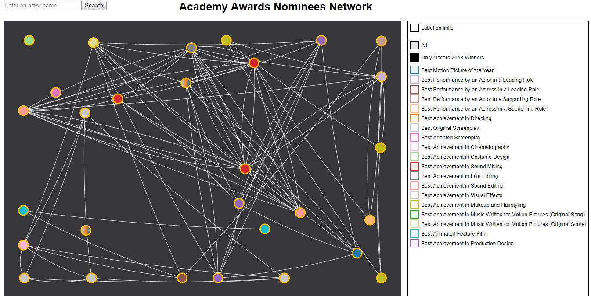

## Update

### Update list since since 02/03/2018 :
* We surrounded the winners' nodes in orange and added a "Only Oscars Winners 2018" filter to display only these people.

<table border="0">
  <tr>
    <td>
      
    </td>
  </tr>
  <tr>
    <td align="center">
      Oscars winners
    </td>
  </tr>
</table>

* Update the data parser to have all the links (previous version some links between artists were missing)
* Correct all the filter bug (deselect All, select one category, then another and deselect the first)
* Give sens to the selection/unselection of the color checkbox (ex : if one category is uncheck, then All is automatically unchecked)
* Correct click on node bug (when clicking on a node, sometime some neighbours of its disapear)
* Adujst force and distance proportionnal to the label length (enough place to write the movie when passing the mouse over a node)
* Choose dynamically the orientation of the text movie label depending on the abscissa of the nodes
